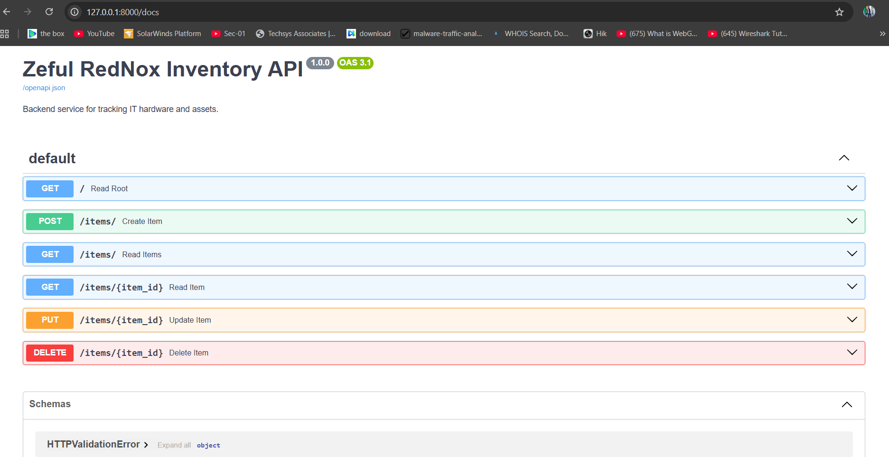
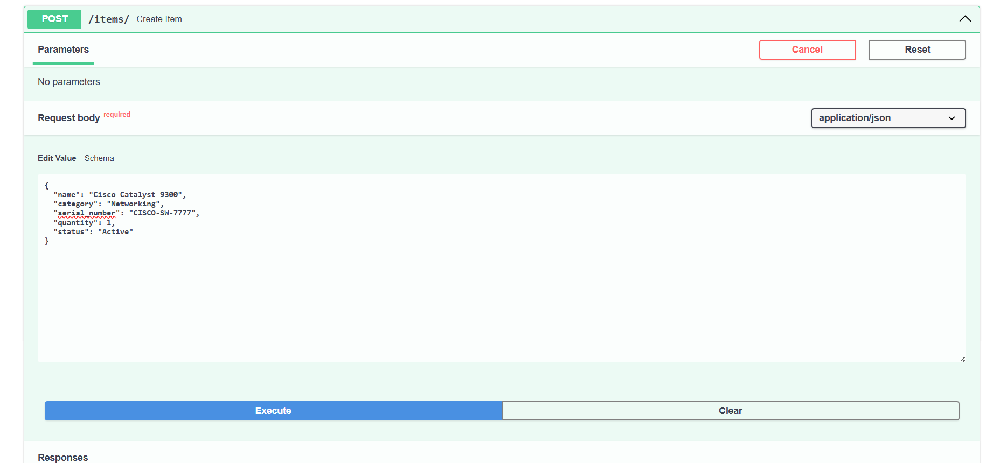
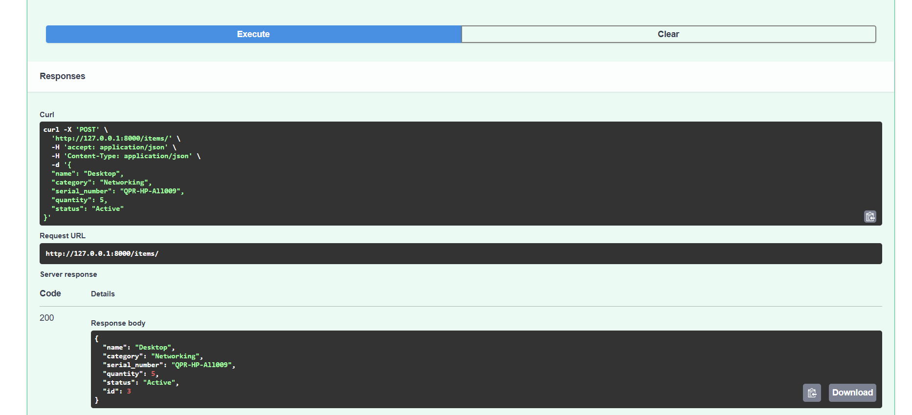
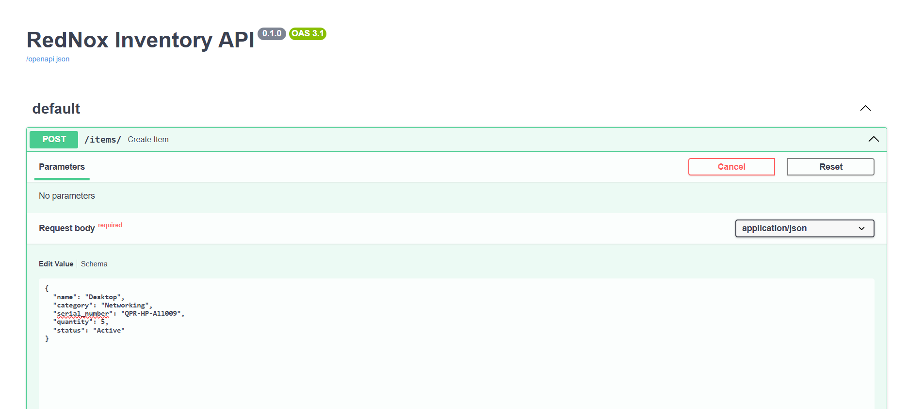
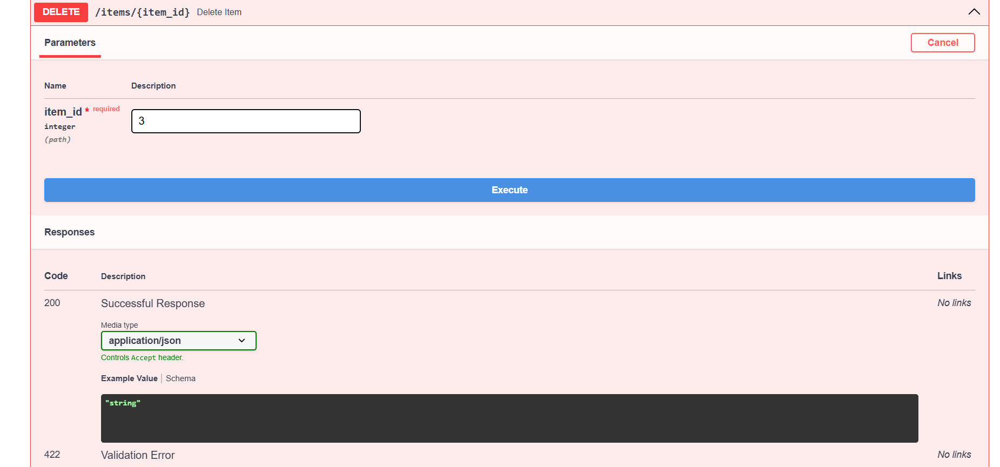
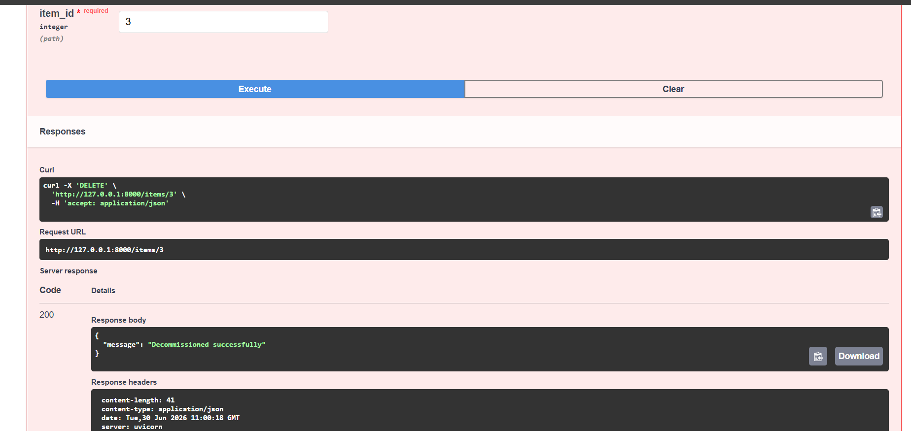

Redynox Internship: 
Project Documentation

Task 1: Backend API ServiceAPI OverviewThe system is built on FastAPI, featuring a RESTful architecture for tracking IT hardware assets. The backend is fully documented via Swagger UI, allowing for interactive testing of all CRUD endpoints.  

Functional Verification Create Item: The POST /items/ endpoint successfully registers new hardware into the SQLite database, with input validation to prevent duplicate serial numbers. (Refer to Create.png, C.png, and c1.png in docs).

Get All Items: The GET /items/ endpoint retrieves the full asset registry. (Refer to Get All input postman.png).

Delete Item: The DELETE /items/{item_id} endpoint safely decommissions assets from the database. (Refer to Delete.png and D.png in docs).Technical Architecture, the backend utilizes SQLAlchemy as an ORM to handle database interactions, ensuring queries are executed securely to block SQL injection vulnerabilities. (Refer to Backend.png and DB Running.png in docs).  

Task 2: Automation ScriptFunctional OverviewThe automation script functions as a background task, extracting live data from the inventory API and generating compliance-ready hardware reports.  

Test Results Report Generation: The script processes database records and compiles them into CSV and PDF formats.  Notification Engine: Upon completion, the system triggers an SMTP email alert, delivering the generated reports directly to the relevant IT stakeholder. (Refer to Automated Email.png and Automated Email message.png). 

# Redynox Internship: Project Documentation

## Task 1: Backend API Service
*API Overview: The system is built on **FastAPI**, featuring a RESTful architecture for tracking IT hardware assets. The backend is fully documented via Swagger UI, allowing for interactive testing of all CRUD endpoints.*

### Functional Verification

---

## Task 2.5: Automated Reporting Evidence
*Overview: The automation script functions as a background task, extracting live data from the inventory API and generating compliance-ready hardware reports.*

### Visual Evidence: Automation & Reporting

